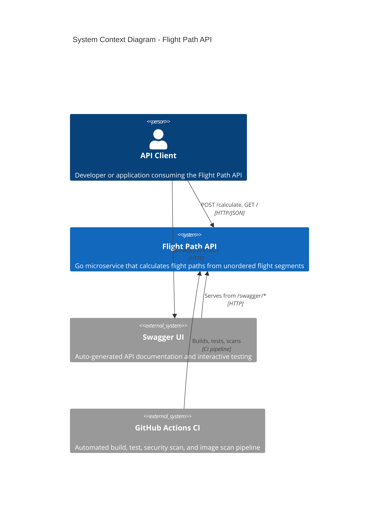
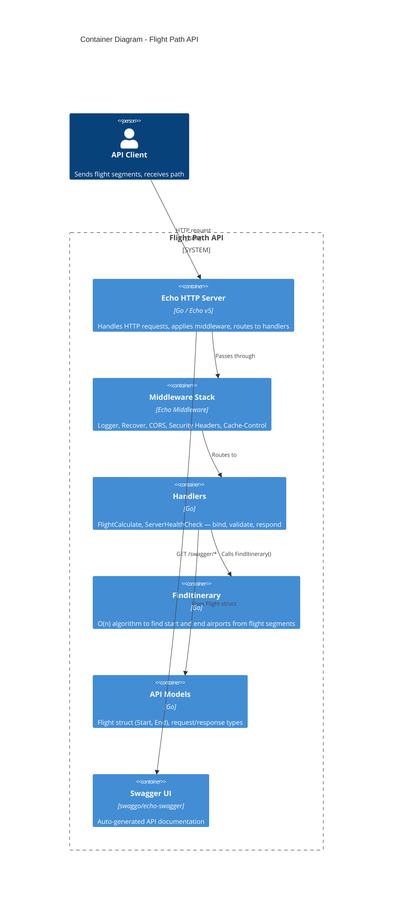
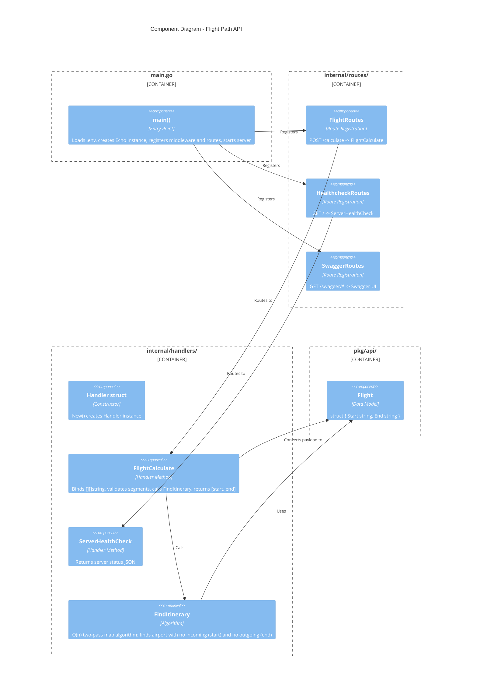
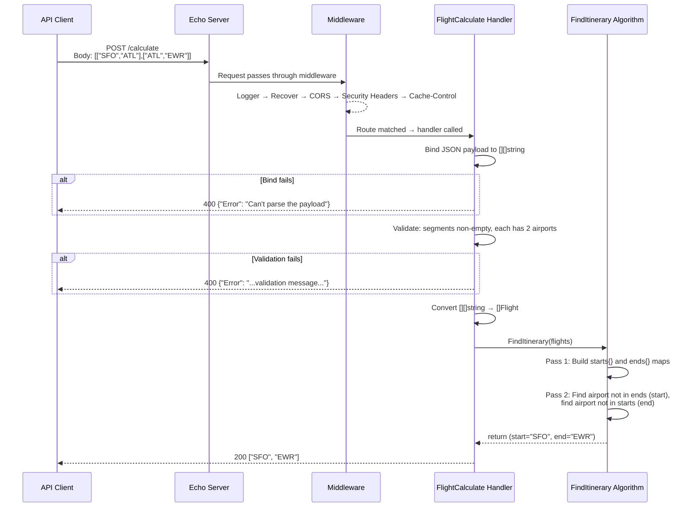
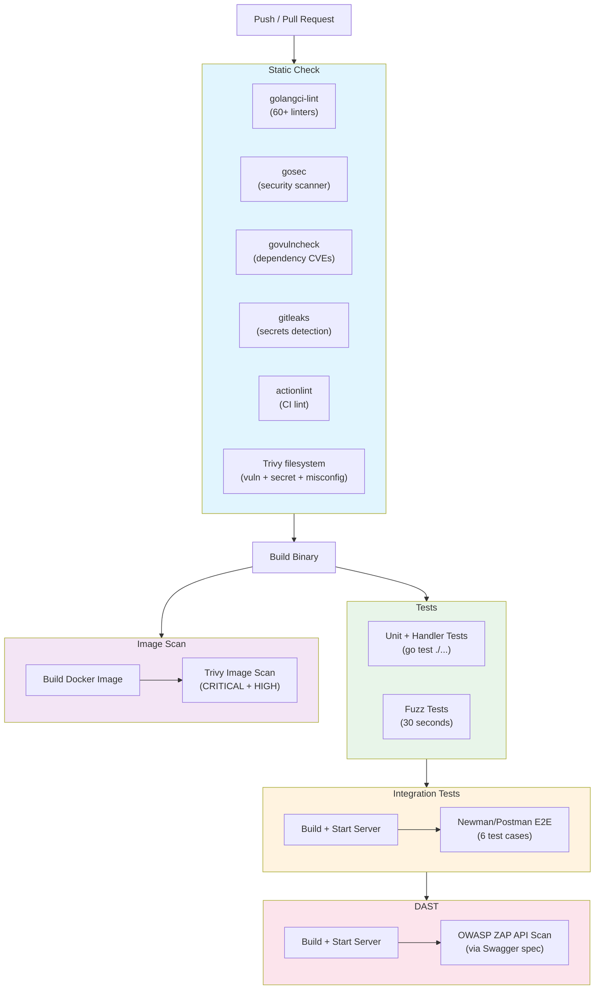

[](https://github.com/AndriyKalashnykov/flight-path/actions/workflows/ci.yml)
[](https://hits.sh/github.com/AndriyKalashnykov/flight-path/)
[](https://opensource.org/licenses/MIT)
[](https://app.renovatebot.com/dashboard#github/AndriyKalashnykov/flight-path)
# REST API server to determine the flight path of a person

Story: There are over 100,000 flights a day, with millions of people and cargo being transferred around the world.
With so many people and different carrier/agency groups, it can be hard to track where a person might be.
In order to determine the flight path of a person, we must sort through all of their flight records.

Goal: To create a simple microservice API that can help us understand and track how a particular person's flight path
may be queried. The API should accept a request that includes a list of flights, which are defined by a source and
destination airport code. These flights may not be listed in order and will need to be sorted to find the total
flight paths starting and ending airports.

## Architecture

### C4 Context Diagram

Shows the system boundary and external actors interacting with the Flight Path API.


```mermaid
C4Context
    title System Context Diagram - Flight Path API

    Person(user, "API Client", "Developer or application consuming the Flight Path API")

    System(flightpath, "Flight Path API", "Go microservice that calculates flight paths from unordered flight segments")

    System_Ext(swagger, "Swagger UI", "Auto-generated API documentation and interactive testing")
    System_Ext(ci, "GitHub Actions CI", "Automated build, test, security scan, and image scan pipeline")

    Rel(user, flightpath, "POST /calculate, GET /", "HTTP/JSON")
    Rel(user, swagger, "Browses API docs", "HTTP")
    Rel(swagger, flightpath, "Serves from /swagger/*", "HTTP")
    Rel(ci, flightpath, "Builds, tests, scans", "CI pipeline")
```

### C4 Container Diagram

Shows the internal containers of the Flight Path API system.


```mermaid
C4Container
    title Container Diagram - Flight Path API

    Person(client, "API Client", "Sends flight segments, receives path")

    System_Boundary(api, "Flight Path API") {
        Container(echo, "Echo HTTP Server", "Go / Echo v5", "Handles HTTP requests, applies middleware, routes to handlers")
        Container(middleware, "Middleware Stack", "Echo Middleware", "Logger, Recover, CORS, Security Headers, Cache-Control")
        Container(handlers, "Handlers", "Go", "FlightCalculate, ServerHealthCheck — bind, validate, respond")
        Container(algorithm, "FindItinerary", "Go", "O(n) algorithm to find start and end airports from flight segments")
        Container(models, "API Models", "Go", "Flight struct (Start, End), request/response types")
        Container(swaggerui, "Swagger UI", "swaggo/echo-swagger", "Auto-generated API documentation")
    }

    Rel(client, echo, "HTTP request", "JSON")
    Rel(echo, middleware, "Passes through")
    Rel(middleware, handlers, "Routes to")
    Rel(handlers, algorithm, "Calls FindItinerary()")
    Rel(handlers, models, "Uses Flight struct")
    Rel(echo, swaggerui, "GET /swagger/*")
```

### C4 Component Diagram

Shows the internal components and their relationships.


```mermaid
C4Component
    title Component Diagram - Flight Path API

    Container_Boundary(main_boundary, "main.go") {
        Component(entrypoint, "main()", "Entry Point", "Loads .env, creates Echo instance, registers middleware and routes, starts server")
    }

    Container_Boundary(routes_boundary, "internal/routes/") {
        Component(flight_routes, "FlightRoutes", "Route Registration", "POST /calculate -> FlightCalculate")
        Component(health_routes, "HealthcheckRoutes", "Route Registration", "GET / -> ServerHealthCheck")
        Component(swagger_routes, "SwaggerRoutes", "Route Registration", "GET /swagger/* -> Swagger UI")
    }

    Container_Boundary(handlers_boundary, "internal/handlers/") {
        Component(handler_struct, "Handler struct", "Constructor", "New() creates Handler instance")
        Component(flight_handler, "FlightCalculate", "Handler Method", "Binds [][]string, validates segments, calls FindItinerary, returns [start, end]")
        Component(health_handler, "ServerHealthCheck", "Handler Method", "Returns server status JSON")
        Component(find_itinerary, "FindItinerary", "Algorithm", "O(n) two-pass map algorithm: finds airport with no incoming (start) and no outgoing (end)")
    }

    Container_Boundary(pkg_boundary, "pkg/api/") {
        Component(flight_model, "Flight", "Data Model", "struct { Start string, End string }")
    }

    Rel(entrypoint, flight_routes, "Registers")
    Rel(entrypoint, health_routes, "Registers")
    Rel(entrypoint, swagger_routes, "Registers")
    Rel(flight_routes, flight_handler, "Routes to")
    Rel(health_routes, health_handler, "Routes to")
    Rel(flight_handler, find_itinerary, "Calls")
    Rel(find_itinerary, flight_model, "Uses")
    Rel(flight_handler, flight_model, "Converts payload to")
```

### Request Flow — POST /calculate

Sequence diagram showing how a flight path calculation request flows through the system.


```mermaid
sequenceDiagram
    participant C as API Client
    participant E as Echo Server
    participant MW as Middleware
    participant H as FlightCalculate Handler
    participant A as FindItinerary Algorithm

    C->>E: POST /calculate<br/>Body: [["SFO","ATL"],["ATL","EWR"]]
    E->>MW: Request passes through middleware
    MW-->>MW: Logger → Recover → CORS → Security Headers → Cache-Control
    MW->>H: Route matched → handler called

    H->>H: Bind JSON payload to [][]string
    alt Bind fails
        H-->>C: 400 {"Error": "Can't parse the payload"}
    end

    H->>H: Validate: segments non-empty, each has 2 airports
    alt Validation fails
        H-->>C: 400 {"Error": "...validation message..."}
    end

    H->>H: Convert [][]string → []Flight
    H->>A: FindItinerary(flights)

    A->>A: Pass 1: Build starts{} and ends{} maps
    A->>A: Pass 2: Find airport not in ends (start),<br/>find airport not in starts (end)
    A-->>H: return (start="SFO", end="EWR")

    H-->>C: 200 ["SFO", "EWR"]
```

### CI/CD Pipeline

GitHub Actions workflow showing the build, test, and security scanning pipeline.


```mermaid
flowchart TD
    trigger["Push / Pull Request"] --> static

    subgraph static["Static Check"]
        lint["golangci-lint<br/>(60+ linters)"]
        sec["gosec<br/>(security scanner)"]
        vuln["govulncheck<br/>(dependency CVEs)"]
        secrets["gitleaks<br/>(secrets detection)"]
        actionlint["actionlint<br/>(CI lint)"]
        trivyfs["Trivy filesystem<br/>(vuln + secret + misconfig)"]
    end

    static --> builds["Build Binary"]
    builds --> tests

    subgraph tests["Tests"]
        unit["Unit + Handler Tests<br/>(go test ./...)"]
        fuzz["Fuzz Tests<br/>(30 seconds)"]
    end

    builds --> imgscan

    subgraph imgscan["Image Scan"]
        docker["Build Docker Image"]
        trivyimg["Trivy Image Scan<br/>(CRITICAL + HIGH)"]
        docker --> trivyimg
    end

    tests --> integration

    subgraph integration["Integration Tests"]
        start["Build + Start Server"]
        newman["Newman/Postman E2E<br/>(6 test cases)"]
        start --> newman
    end

    integration --> dast

    subgraph dast["DAST"]
        zapstart["Build + Start Server"]
        zap["OWASP ZAP API Scan<br/>(via Swagger spec)"]
        zapstart --> zap
    end

    style static fill:#e1f5fe
    style tests fill:#e8f5e9
    style integration fill:#fff3e0
    style dast fill:#fce4ec
    style imgscan fill:#f3e5f5
```

### Requirements

- [gvm](https://github.com/moovweb/gvm) Go
    ```bash
    gvm install go1.26.0 --prefer-binary --with-build-tools --with-protobuf
    gvm use go1.26.0 --default
    ```
  - [nmv](https://github.com/nvm-sh/nvm) Node
  ```bash
    nvm install --lts
    nvm use --lts
    npm install yarn --global
    npm install npm --global
    npm install -g pnpm
    pnpm add -g pnpm
  ```
- All dev tools are installed automatically:
  ```bash
  make deps
  ```

## Help

```text
Usage: make COMMAND
Commands :
help            - List available tasks
deps            - Download and install dependencies
api-docs        - Build source code for swagger api reference
lint            - Run golangci-lint (60+ linters via .golangci.yml)
sec             - Run gosec security scanner
vulncheck       - Run Go vulnerability check on dependencies
secrets         - Scan for hardcoded secrets in source code and git history
lint-ci         - Lint GitHub Actions workflow files
test            - Run tests
bench           - Run bench tests
bench-save      - Save benchmark results to file
bench-compare   - Compare two benchmark files
fuzz            - Run fuzz tests for 30 seconds
build           - Build REST API server's binary
run             - Run REST API locally
build-image     - Build Docker image
release         - Create and push a new tag
update          - Update dependencies to latest versions
open-swagger    - Open browser with Swagger docs pointing to localhost
test-case-one   - Test case 1 [["SFO", "EWR"]]
test-case-two   - Test case 2 [["ATL", "EWR"], ["SFO", "ATL"]]
test-case-three - Test case 3 [["IND", "EWR"], ["SFO", "ATL"], ["GSO", "IND"], ["ATL", "GSO"]]
e2e             - Run Postman/Newman end-to-end tests
```

## Start REST API server

```bash
make run
```

## Run test cases

```bash
make test-case-one
make test-case-two
make test-case-three
```

## Security & Code Quality

### SAST (Static Application Security Testing)

| Tool | Command | What it does |
|------|---------|-------------|
| [gosec](https://github.com/securego/gosec) | `make sec` | Go-specific security scanner (injection, crypto, permissions) |
| [govulncheck](https://pkg.go.dev/golang.org/x/vuln/cmd/govulncheck) | `make vulncheck` | Checks dependencies against the Go vulnerability database |
| [gitleaks](https://github.com/gitleaks/gitleaks) | `make secrets` | Scans source code and git history for hardcoded secrets |

### DAST (Dynamic Application Security Testing)

| Tool | Where | What it does |
|------|-------|-------------|
| [OWASP ZAP](https://github.com/zaproxy/zaproxy) | CI only | API security scan using Swagger/OpenAPI spec |

### Linting

| Tool | Command | What it does |
|------|---------|-------------|
| [golangci-lint](https://github.com/golangci/golangci-lint) | `make lint` | Meta-linter running 60+ linters (configured via `.golangci.yml`) |
| [actionlint](https://github.com/rhysd/actionlint) | `make lint-ci` | Lints GitHub Actions workflow files |

### Container Security

| Tool | Where | What it does |
|------|-------|-------------|
| [Trivy](https://github.com/aquasecurity/trivy) | CI only | Scans Docker images and filesystem for CVEs |

### Testing

| Tool | Command | What it does |
|------|---------|-------------|
| go test | `make test` | Unit and handler tests (table-driven) |
| go test -bench | `make bench` | Benchmark tests for critical paths |
| go test -fuzz | `make fuzz` | Fuzz testing for FindItinerary algorithm |
| [Newman](https://github.com/postmanlabs/newman) | `make e2e` | Postman/Newman end-to-end API tests |

### Pre-commit Checklist

```bash
make lint && make sec && make vulncheck && make secrets && make test && make api-docs && make build
```

## SwaggerUI

Take a look at autogenerated REST API Documentation

[Swagger API documentation - http://localhost:8080/swagger/index.html](http://localhost:8080/swagger/index.html)


## API Endpoint documentation

[API Endpoint documentation](./docs/swagger.json)

```json
        "/calculate": {
            "post": {
                "description": "get the flight path of a person.",
                "consumes": [
                    "application/json"
                ],
                "produces": [
                    "application/json"
                ],
                "tags": [
                    "FlightCalculate"
                ],
                "summary": "Determine the flight path of a person.",
                "operationId": "flightCalculate-get",
                "parameters": [
                    {
                        "description": "Flight segments",
                        "name": "flightSegments",
                        "in": "body",
                        "required": true,
                        "schema": {
                            "type": "array",
                            "items": {
                                "type": "array",
                                "items": {
                                    "type": "string"
                                }
                            }
                        }
                    }
                ],
                "responses": {
                    "200": {
                        "description": "OK",
                        "schema": {
                            "type": "array",
                            "items": {
                                "type": "string"
                            }
                        }
                    },
                    "500": {
                        "description": "Internal Server Error",
                        "schema": {
                            "type": "object",
                            "additionalProperties": true
                        }
                    }
                }
            }
        }
```

## GitHub CI

GitHub CI pipeline:

| Job | Steps |
|-----|-------|
| **static-check** | golangci-lint, gosec, govulncheck, gitleaks, actionlint, Trivy filesystem scan |
| **builds** | Build binary |
| **tests** | Unit + handler tests |
| **integration** | Build, run server, Newman/Postman E2E tests |
| **dast** | Build, run server, OWASP ZAP API security scan |
| **image-scan** | Build Docker image, Trivy vulnerability scan |

## Postman/Newman end-to-end tests

Utilized Postman collection exported to [JSON file](./test/FlightPath.postman_collection.json)
and executes same use cases as Makefile targets `test-case-one` `test-case-two` `test-case-three`, plus negative test cases (empty body, malformed JSON, incomplete segment)


