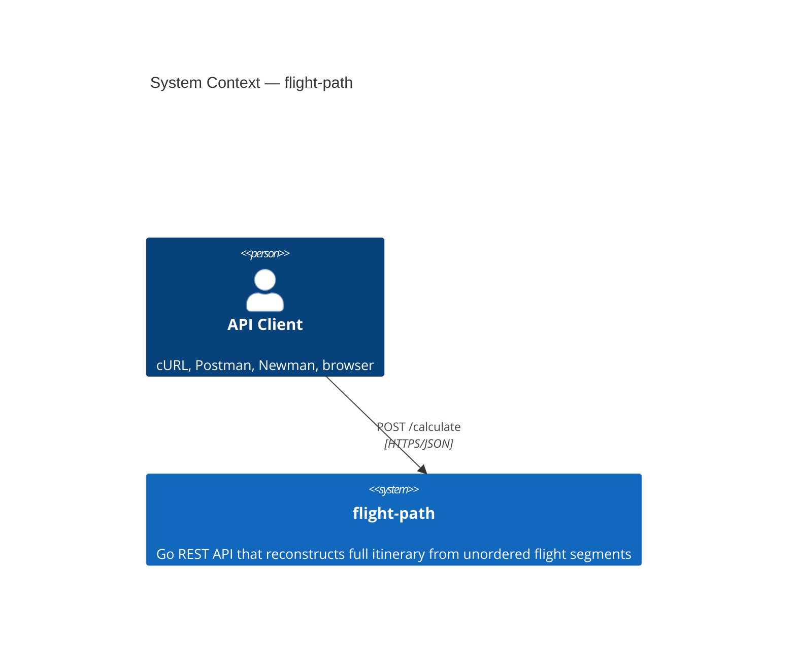
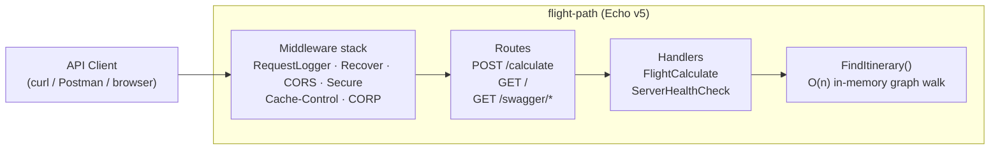
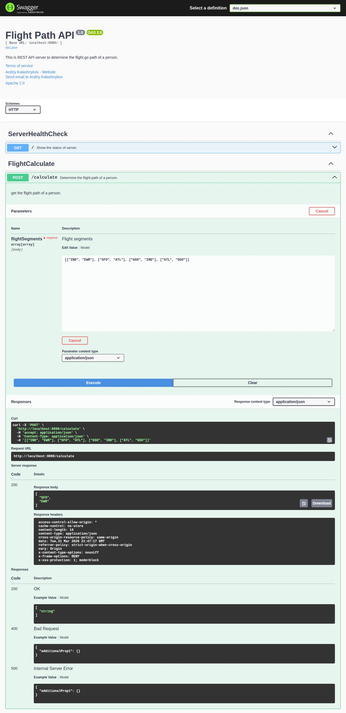
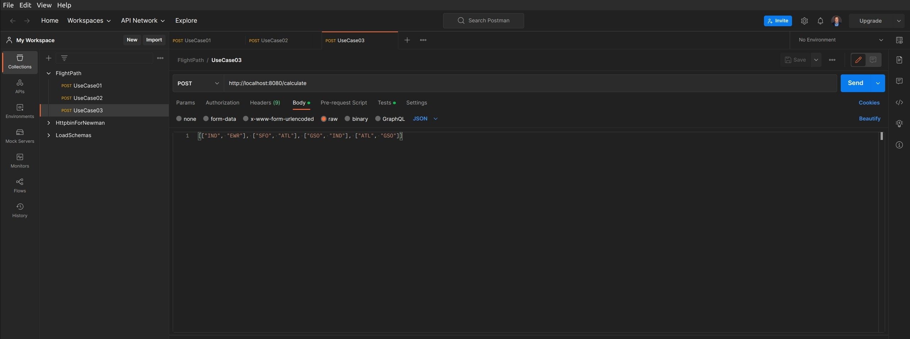

[](https://github.com/AndriyKalashnykov/flight-path/actions/workflows/ci.yml)
[](https://hits.sh/github.com/AndriyKalashnykov/flight-path/)
[](https://opensource.org/licenses/MIT)
[](https://app.renovatebot.com/dashboard#github/AndriyKalashnykov/flight-path)

# Go REST API to reconstruct flight paths from unordered segments

A Go REST API microservice that calculates flight paths from unordered flight segments. Given a list of [source, destination] pairs, it determines the complete path from start to end airport.

## Overview


```mermaid
C4Context
    title System Context — flight-path
    Person(client, "API Client", "cURL, Postman, Newman, browser")
    System(flightpath, "flight-path", "Go REST API that reconstructs full itinerary from unordered flight segments")
    Rel(client, flightpath, "POST /calculate", "HTTPS/JSON")
    UpdateLayoutConfig($c4ShapeInRow="2")
```

See [docs/ARCHITECTURE.md](./docs/ARCHITECTURE.md) for Container, request-flow sequence, and CI/CD pipeline diagrams.

## Tech Stack

| Component | Technology | Rationale |
|-----------|------------|-----------|
| Language | Go 1.26.2 (from `go.mod`) | Statically compiled binary, strong stdlib HTTP, goroutine concurrency |
| Framework | Echo v5.1.0 | Lightweight router with built-in JSON binding, middleware stack, Swagger integration |
| API Docs | Swagger (swaggo/swag v2) | Auto-generated OpenAPI spec from Go annotations |
| Testing | go test (unit, bench, fuzz), Newman/Postman (E2E) | Table-driven unit tests + black-box API tests against the built binary |
| Linting | golangci-lint v2.11.4, hadolint, actionlint, shellcheck, mermaid-cli | Meta-linter + Dockerfile + workflows + shell + diagrams |
| Container | Docker (multi-stage Alpine) | Small image, reproducible build, scratch-like runtime |
| CI/CD | GitHub Actions + GoReleaser | Tag-gated release pipeline with cosign keyless signing |
| Dependencies | Renovate | Auto-updates with platform automerge and security fast-track |

## Quick Start

```bash
make deps      # install dev tools (golangci-lint, gosec, swag, pnpm, newman, etc.)
make build     # generate Swagger docs + compile binary
make test      # run unit + handler tests
make run       # build and start the server
# Open http://localhost:8080/swagger/index.html
```

## Prerequisites

| Tool | Version | Purpose |
|------|---------|---------|
| [Go](https://go.dev/dl/) | 1.26.2 (see `go.mod`) | Language runtime and compiler |
| [mise](https://mise.jdx.dev/) | latest | Toolchain manager — reads `.mise.toml` to install pinned Go + Node |
| [GNU Make](https://www.gnu.org/software/make/) | 3.81+ | Build orchestration |
| [Git](https://git-scm.com/) | 2.0+ | Version control |
| [Docker](https://www.docker.com/) | latest | Container builds and testing |
| [Node.js](https://nodejs.org/) | 24 (from `.nvmrc` / `.mise.toml`) | Newman E2E tests *(installed via mise)* |
| [pnpm](https://pnpm.io/) | pinned in `test/package.json` | Newman package manager *(enabled via corepack)* |
| [curl](https://curl.se/) | any | Ad-hoc API calls (`make test-case-*`) |

Install all required dev tools:

```bash
make deps
```

## Architecture

Layered Go microservice with a single HTTP endpoint over an in-memory algorithm — no database, no external services.

| Layer | Location | Responsibility |
|-------|----------|----------------|
| Entry point | `main.go` | Load `.env`, construct `App`, start Echo server on `SERVER_PORT` |
| Bootstrap | `internal/app/` | Wire Echo instance, middleware stack (RequestLogger, Recover, CORS, Secure, Cache-Control/CORP custom headers), routes |
| Routes | `internal/routes/` | Register method-verb mappings against a `*handlers.Handler` |
| Handlers | `internal/handlers/` | Bind request, validate, delegate to `FindItinerary`, return JSON |
| Algorithm | `internal/handlers/api.go` | `FindItinerary` — O(n) reconstruction: build source/destination sets, find unique start (in-degree 0) and end (out-degree 0) airports |
| Public types | `pkg/api/` | `Flight{Start,End}` struct exported for consumers |


```mermaid
flowchart LR
    client["API Client<br/>(curl / Postman / browser)"]
    subgraph server["flight-path (Echo v5)"]
        mw["Middleware stack<br/>RequestLogger · Recover · CORS · Secure<br/>Cache-Control · CORP"]
        routes["Routes<br/>POST /calculate<br/>GET /<br/>GET /swagger/*"]
        handlers["Handlers<br/>FlightCalculate<br/>ServerHealthCheck"]
        algo["FindItinerary()<br/>O(n) in-memory graph walk"]
    end
    client --> mw --> routes --> handlers --> algo
```

See [`docs/ARCHITECTURE.md`](./docs/ARCHITECTURE.md) for Container, request-flow sequence, and CI/CD pipeline diagrams.

## API

- **POST /calculate** — accepts `[][]string` flight segments, returns `[]string` (start and end airports)
- **GET /** — health check
- **GET /swagger/*** — Swagger UI ([http://localhost:8080/swagger/index.html](http://localhost:8080/swagger/index.html))

Auto-generated OpenAPI spec: [`docs/swagger.json`](./docs/swagger.json)



## Security & Code Quality

### SAST (Static Application Security Testing)

| Tool | Command | What it does |
|------|---------|-------------|
| [gosec](https://github.com/securego/gosec) | `make sec` | Go-specific security scanner (injection, crypto, permissions) |
| [govulncheck](https://pkg.go.dev/golang.org/x/vuln/cmd/govulncheck) | `make vulncheck` | Checks dependencies against the Go vulnerability database |
| [gitleaks](https://github.com/gitleaks/gitleaks) | `make secrets` | Scans source code and git history for hardcoded secrets |

### DAST (Dynamic Application Security Testing)

| Tool | Where | What it does |
|------|-------|-------------|
| [OWASP ZAP](https://github.com/zaproxy/zaproxy) | CI only | API security scan using Swagger/OpenAPI spec |

### Linting

| Tool | Command | What it does |
|------|---------|-------------|
| [golangci-lint](https://github.com/golangci/golangci-lint) | `make lint` | Meta-linter with comprehensive rule set (configured via `.golangci.yml`) |
| [hadolint](https://github.com/hadolint/hadolint) | `make lint` | Dockerfile linter |
| [actionlint](https://github.com/rhysd/actionlint) | `make lint-ci` | Lints GitHub Actions workflow files (uses shellcheck internally) |
| [shellcheck](https://github.com/koalaman/shellcheck) | `make lint-ci` | Validates shell scripts inside workflow `run:` steps |
| [mermaid-cli](https://github.com/mermaid-js/mermaid-cli) | `make mermaid-lint` | Validates Mermaid diagrams in markdown files against GitHub's renderer |

### Container Security

| Tool | Where | What it does |
|------|-------|-------------|
| [Trivy](https://github.com/aquasecurity/trivy) | CI + local (`make trivy-fs`, `make image-scan`) | Scans Docker images and filesystem for CVEs |

### Testing

| Tool | Command | What it does |
|------|---------|-------------|
| go test | `make test` | Unit and handler tests (table-driven) |
| go test -bench | `make bench` | Benchmark tests for critical paths |
| go test -fuzz | `make fuzz` | Fuzz testing for FindItinerary algorithm |
| [Newman](https://github.com/postmanlabs/newman) | `make e2e` | Postman/Newman end-to-end API tests |

### End-to-end tests (Postman/Newman)

The Postman collection ([JSON](./test/FlightPath.postman_collection.json)) executes 18 test cases:

- **HealthCheck** — `GET /` returns `{"data": "..."}`
- **UseCase01–03** — happy paths matching `test-case-one`, `test-case-two`, `test-case-three` (1, 2, 4 segments)
- **UseCase04_EmptyBody** — `[]` → 400 "empty segments"
- **UseCase05_MalformedJSON** — `not valid json` → 400 "parse"
- **UseCase06_IncompleteSegment** — `[["SFO"]]` → 400 "source and destination"
- **UseCase07_ExtraItemsInSegmentIgnored** — `[["SFO","EWR","JFK"]]` → 200, first two elements used
- **UseCase08_TenSegmentChain** — 10 scrambled segments resolving LAX→SFO, exercises the algorithm on longer inputs
- **UseCase09_ObjectRoot** — `{"foo":"bar"}` → 400 "parse" (wrong root JSON type)
- **UseCase10_SecondSegmentIncomplete** — `[["SFO","EWR"],["JFK"]]` → 400 with `Index: 1` pointing at the offending segment
- **HealthCheck_SecurityHeaders** — asserts HSTS / X-Content-Type-Options / X-Frame-Options / CSP on `/`
- **HealthCheck_CORS** — asserts default `Access-Control-Allow-Origin: *`
- **Swagger_UI** — asserts `GET /swagger/index.html` returns 200 HTML
- **UseCase11_WrongMethod** — `GET /calculate` → 405
- **UseCase12_UnknownRoute** — `GET /does-not-exist` → 404
- **UseCase13_LargeChain** — 100-segment chain exercising the algorithm on wide inputs
- **UseCase14_WrongContentType** — `text/plain` body → 400 "content-type"

Uses hybrid validation: Ajv JSON Schema validation for `/calculate` response structure (global schemas defined at collection level) and Chai assertions for exact business values. The collection-level schema check skips non-`/calculate` requests so the HealthCheck assertions run in isolation.



## Available Make Targets

Run `make help` to see all available targets.

### Build & Run

| Target | Description |
|--------|-------------|
| `make build` | Build REST API server's binary |
| `make run` | Run REST API locally |
| `make api-docs` | Build source code for swagger api reference |
| `make clean` | Remove build artifacts and test cache |
| `make update` | Update dependencies to latest versions |

### Testing

| Target | Description |
|--------|-------------|
| `make test` | Run unit + handler tests with `-race` |
| `make integration-test` | Run integration tests (full HTTP stack + middleware; `//go:build integration`) |
| `make fuzz` | Run fuzz tests for 30 seconds |
| `make bench` | Run bench tests |
| `make bench-save` | Save benchmark results to file |
| `make bench-compare` | Compare two benchmark files (auto-discovers latest two, or: `make bench-compare OLD=file1.txt NEW=file2.txt`) |
| `make coverage` | Run tests with coverage report |
| `make coverage-check` | Verify coverage meets 80% threshold |
| `make e2e` | Self-contained: build + start server + run Newman + stop server |
| `make e2e-quick` | Run Postman/Newman tests against an already-running server |

### Code Quality

| Target | Description |
|--------|-------------|
| `make format` | Format Go code (rewrites in place; for dev use) |
| `make format-check` | Verify Go code is gofmt-clean (CI gate; non-mutating, exits non-zero on diff) |
| `make lint` | Run golangci-lint and hadolint (comprehensive linting via .golangci.yml) |
| `make sec` | Run gosec security scanner |
| `make vulncheck` | Run Go vulnerability check on dependencies |
| `make secrets` | Scan for hardcoded secrets in source code and git history |
| `make lint-ci` | Lint GitHub Actions workflow files |
| `make mermaid-lint` | Validate Mermaid diagrams in markdown files |
| `make release-check` | Validate `.goreleaser.yml` syntax and config via `goreleaser check` |
| `make static-check` | Run code static check (format-check + lint-ci + lint + sec + vulncheck + secrets + trivy-fs + mermaid-lint + release-check) |

### Docker

| Target | Description |
|--------|-------------|
| `make image-build` | Build Docker image for local testing |
| `make image-run` | Run Docker container locally (detached; use `image-stop` to tear down) |
| `make image-stop` | Stop the locally running Docker container |
| `make image-push` | Push Docker image to GHCR (requires `GH_ACCESS_TOKEN`; `GHCR_USER` defaults to `git config user.name`) |
| `make image-smoke-test` | Smoke-test a pre-built Docker container (no rebuild) |
| `make image-structure-test` | Validate Dockerfile metadata + binary properties via container-structure-test |
| `make image-test` | Build, smoke-test, and structure-test Docker container |
| `make image-scan` | Build Docker image and run Trivy scan (requires trivy) |
| `make trivy-fs` | Run Trivy filesystem vulnerability scan (requires trivy) |
| `make trivy-image` | Run Trivy image vulnerability scan (requires trivy) |

### CI

| Target | Description |
|--------|-------------|
| `make ci` | Run full CI pipeline locally (deps + static-check + test + integration-test + coverage-check + build + fuzz + deps-prune-check) |
| `make ci-run` | Run GitHub Actions workflow locally using [act](https://github.com/nektos/act) |
| `make check` | Run pre-commit checklist (alias for `make ci`) |

### Utilities

| Target | Description |
|--------|-------------|
| `make help` | List available tasks |
| `make deps` | Install dev tools — `mise install` reads `.mise.toml` and provisions Go, Node, and every quality/security tool (golangci-lint, gosec, govulncheck, gitleaks, actionlint, shellcheck, hadolint, trivy, act, goreleaser). swag + benchstat stay Go-installed; newman via pnpm + corepack |
| `make deps-check` | Show required Go version, mise status, and tool status |
| `make release` | Run full CI pipeline then tag and push a new release |
| `make open-swagger` | Open browser with Swagger docs pointing to localhost |
| `make renovate-validate` | Validate Renovate configuration |
| `make deps-prune` | Remove unused Go module dependencies |
| `make deps-prune-check` | Verify no prunable dependencies (CI gate) |
| `make test-case-one` | Test case #1 `[["SFO", "EWR"]]` |
| `make test-case-two` | Test case #2 `[["ATL", "EWR"], ["SFO", "ATL"]]` |
| `make test-case-three` | Test case #3 `[["IND", "EWR"], ["SFO", "ATL"], ["GSO", "IND"], ["ATL", "GSO"]]` |

## CI/CD

GitHub Actions runs on every push to `main`, tags `v*`, and pull requests. All jobs live in a single workflow file (`.github/workflows/ci.yml`). The workflow always triggers; a `changes` detector job (`dorny/paths-filter`) gates every heavy job on whether the push touches code — doc-only PRs only run `changes` (~10s) and `ci-pass`. The release-side `goreleaser` (tag-only) and `docker` (every push, push/sign tag-gated) are serialized via `needs:` so a tag either produces both the GitHub Release AND the GHCR image, or neither.

| Job | Triggers | Steps |
|-----|----------|-------|
| **changes** | push, PR, tags | `dorny/paths-filter` — emits `code` output. Filter: `!(**.md|docs/**|specs/**|LICENSE|.gitignore|.claudeignore|.claude/**|benchmarks/**|**.png|**.jpg|**.gif|**.svg)` plus `CLAUDE.md` re-include. |
| **static-check** | code changes | `make static-check` (format-check + lint-ci + lint + sec + vulncheck + secrets + trivy-fs + mermaid-lint + release-check) |
| **build** | code changes, after static-check | Build binary, upload artifact |
| **test** | code changes, after static-check | Coverage threshold check (80%+), fuzz tests |
| **integration-test** | code changes, after static-check | Full HTTP stack + middleware tests (`//go:build integration`) |
| **e2e** | code changes, after build + test | Download binary (or rebuild fallback), run server, Newman/Postman E2E tests. Runs on every push AND under `act` (no `vars.ACT` guard) — the fallback path rebuilds the binary when cross-job artifact download fails. |
| **dast** | code changes, after build + test | Run server, OWASP ZAP API security scan (skipped under `act`) |
| **goreleaser** | tag push only, after all upstream | GoReleaser build, GitHub release (binaries, archives, checksums, changelog). Anchor of the multi-artifact release — `docker` is serialized after this so a tag either produces both artifacts or none. |
| **docker** | code changes, after static-check + build + test; serialized after goreleaser on tag push | Single-arch build + Trivy image scan (CRITICAL/HIGH blocking) + `make image-smoke-test` + multi-arch build. On `v*.*.*` tag pushes, additionally logs in to GHCR, pushes multi-arch (clean image index, Pattern A), and cosign-signs by digest. On non-tag pushes the login/push/sign steps are skipped — the job still runs end-to-end to catch Dockerfile and multi-arch build regressions on the commit that introduced them, not on release day. |
| **ci-pass** | `if: always()`, needs all | Single branch-protection gate that fails if any upstream job failed. Skipped jobs (changes.code=false on doc-only PRs, goreleaser on non-tag pushes, dast under act) are `result: 'skipped'`, treated as non-failure — ci-pass passes correctly. |

### Required Secrets and Variables

| Name | Type | Used by | How to obtain |
|------|------|---------|---------------|
| `CLAUDE_CONFIG_TOKEN` | Secret | `claude.yml`, `claude-ci-fix.yml` | PAT with `contents: read` for [`AndriyKalashnykov/claude-config`](https://github.com/AndriyKalashnykov/claude-config) — allows workflows to check out shared Claude configuration |
| `ANTHROPIC_API_KEY` | Secret | `claude.yml`, `claude-ci-fix.yml` | [console.anthropic.com](https://console.anthropic.com/) API key — powers the Claude Code action |

Set secrets via **Settings > Secrets and variables > Actions > New repository secret**.
Set variables via **Settings > Secrets and variables > Actions > Variables tab > New repository variable**.

**Local-only variables (act):** `ACT=true` is injected automatically by `make ci-run` (via `--var ACT=true`) to guard the `dast` job, which needs Docker-in-Docker for OWASP ZAP and doesn't run cleanly under act. Do **not** set `ACT` on GitHub Actions runners.

### Pre-push image hardening

The `docker` job runs the following gates on **every push**. Gates 1–3 run unconditionally (catching Dockerfile and Trivy regressions on every commit). Gate 4 (multi-arch build) runs on every push but only pushes to GHCR on `v*.*.*` tag pushes. Gate 5 (cosign signing) is tag-only. Any failure blocks the release.

| # | Gate | Catches | Tool | When |
|---|---|---|---|---|
| 1 | Build local single-arch image | Build regressions on the runner architecture | `docker/build-push-action` with `load: true` | every push |
| 2 | **Trivy image scan** (CRITICAL/HIGH blocking) | CVEs in base image, OS packages, build layers; secrets; misconfigs | `aquasecurity/trivy-action` with `image-ref:` | every push |
| 3 | **Smoke test** | Image boots, health endpoint responds, `/calculate` returns correct result | `make image-smoke-test` | every push |
| 3b | **Container structure test** | Dockerfile metadata invariants (binary path, USER, entrypoint, /etc/passwd content) | `make image-structure-test` | every push |
| 4 | Multi-arch build + conditional push (clean image index) | Multi-arch build regressions (linux/arm64 cross-compile issues); on tags, publishes with `provenance: false` + `sbom: false` so the GHCR "OS / Arch" tab renders correctly | `docker/build-push-action` with `push: ${{ startsWith(github.ref, 'refs/tags/') }}` | every push (build); tag only (push) |
| 5 | **Cosign keyless OIDC signing** | Sigstore signature on the manifest digest (no long-lived keys) — the supply-chain verification primitive for this image | `sigstore/cosign-installer` + `cosign sign` | tag only |

Inspect the published multi-arch manifest:

```bash
docker buildx imagetools inspect ghcr.io/andriykalashnykov/flight-path:<tag>
```

Expect `linux/amd64` and `linux/arm64` platform entries with no `unknown/unknown` rows.

Verify a published image's cosign signature:

```bash
cosign verify ghcr.io/andriykalashnykov/flight-path:<tag> \
  --certificate-identity-regexp 'https://github\.com/AndriyKalashnykov/flight-path/\.github/workflows/ci\.yml@refs/tags/v.*' \
  --certificate-oidc-issuer https://token.actions.githubusercontent.com
```

### Companion workflows

| Workflow | Trigger | Purpose |
|----------|---------|---------|
| [`claude.yml`](./.github/workflows/claude.yml) | `@claude` mention from trusted author; non-draft PR open/sync | Interactive Claude Code responder + automated PR review |
| [`claude-ci-fix.yml`](./.github/workflows/claude-ci-fix.yml) | CI failure on same-repo PR branch | Attempt automated fix with anti-recursion guards (bot-author + label) |
| [`auto-merge.yml`](./.github/workflows/auto-merge.yml) | Renovate PR opened or `ci-pass` succeeds | Enable GitHub native auto-merge on Renovate PRs once required checks pass |
| [`cleanup-runs.yml`](./.github/workflows/cleanup-runs.yml) | Sundays at 00:00 UTC | Delete old workflow runs (retain 7 days, min 5) and prune merged-branch caches |

[Renovate](https://docs.renovatebot.com/) keeps dependencies up to date with platform automerge enabled.

## Contributing

Contributions welcome — open an issue or pull request. Run `make check` locally before pushing.

## License

[MIT](./LICENSE) © Andriy Kalashnykov
