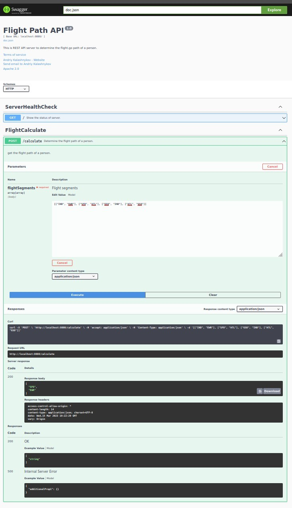

# REST API server to determine the flight path of a person

[](https://app.renovatebot.com/dashboard#github/AndriyKalashnykov/flight-path)

Story: There are over 100,000 flights a day, with millions of people and cargo being transferred around the world. 
With so many people and different carrier/agency groups, it can be hard to track where a person might be. 
In order to determine the flight path of a person, we must sort through all of their flight records.

Goal: To create a simple microservice API that can help us understand and track how a particular person's flight path 
may be queried. The API should accept a request that includes a list of flights, which are defined by a source and 
destination airport code. These flights may not be listed in order and will need to be sorted to find the total 
flight paths starting and ending airports.

### Requirements

- [gvm](https://github.com/moovweb/gvm) Go 1.21.1
    ```bash
    gvm install go1.21.1 --prefer-binary --with-build-tools --with-protobuf
    gvm use go1.21.1 --default
    ```
- Newman (a CLI to run Postman/Newman collections)
  ```bash
  # Install Node.js and NPM package manager
  sudo apt update
  sudo apt install nodejs npm -y
  # Install Newman CLI
  npm install --location=global newman
  ```
## Help

```text
Usage: make COMMAND
Commands :
help            - List available tasks
clean           - Cleanup
deps            - Download and install dependencies
api-docs        - Build source code for swagger api reference
test            - Run tests
build           - Build REST API server's binary
run             - Run REST API locally
release         - Create and push a new tag
update          - Update dependencies to latest versions
open-swagger    - Open browser with Swagger docs pointing to localhost
test-case-one   - Test case 1 [["SFO", "EWR"]]
test-case-two   - Test case 2 [["ATL", "EWR"], ["SFO", "ATL"]]
test-case-three - Test case 3 [["IND", "EWR"], ["SFO", "ATL"], ["GSO", "IND"], ["ATL", "GSO"]]
e2e             - Run Postman/Newman end-to-end tests
```

## Start REST API server

```bash
make run
```

## Run test cases

```bash
make test-case-one
make test-case-two
make test-case-three
```

## SwaggerUI

Take a look at autogenerated REST API Documentation

[Swagger API documentation - http://localhost:8080/swagger/index.html](http://localhost:8080/swagger/index.html)




## API Endpoint documentation

[API Endpoint documentation](./docs/swagger.json)

```json
        "/calculate": {
            "post": {
                "description": "get the flight path of a person.",
                "consumes": [
                    "application/json"
                ],
                "produces": [
                    "application/json"
                ],
                "tags": [
                    "FlightCalculate"
                ],
                "summary": "Determine the flight path of a person.",
                "operationId": "flightCalculate-get",
                "parameters": [
                    {
                        "description": "Flight segments",
                        "name": "flightSegments",
                        "in": "body",
                        "required": true,
                        "schema": {
                            "type": "array",
                            "items": {
                                "type": "array",
                                "items": {
                                    "type": "string"
                                }
                            }
                        }
                    }
                ],
                "responses": {
                    "200": {
                        "description": "OK",
                        "schema": {
                            "type": "array",
                            "items": {
                                "type": "string"
                            }
                        }
                    },
                    "500": {
                        "description": "Internal Server Error",
                        "schema": {
                            "type": "object",
                            "additionalProperties": true
                        }
                    }
                }
            }
        }
```

## GitHub CI

GitHub CI has following steps:
- Checkout
- Set up Node.js (needed to run Postman/Newman end-to-end tests)
- Install dependencies
- Install Newman
- Set up Go
- Test 
- Build
- Run
- Wait for REST API
- Run Postman/Newman end-to-end tests

## Postman/Newman end-to-end tests

Utilized Postman collection exported to [JSON file](./test/FlightPath.postman_collection.json)
and executes same use cases as Makefile targets `test-case-one` `test-case-two` `test-case-three`


