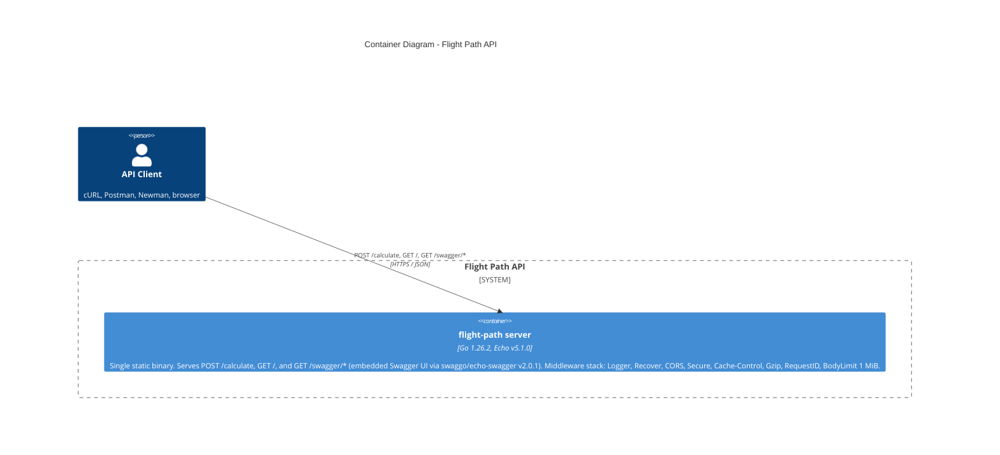
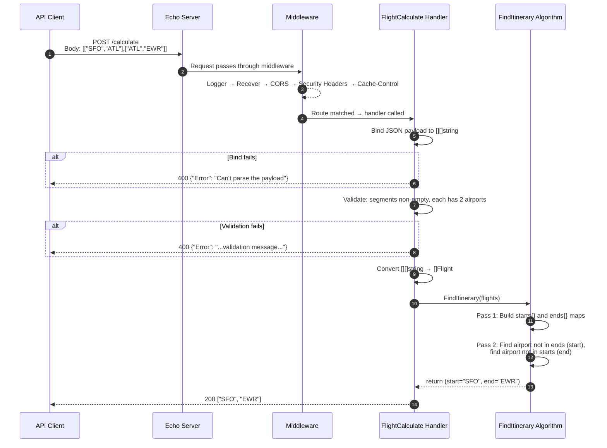
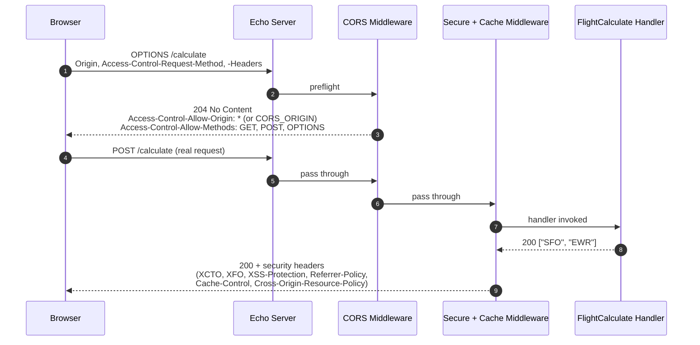
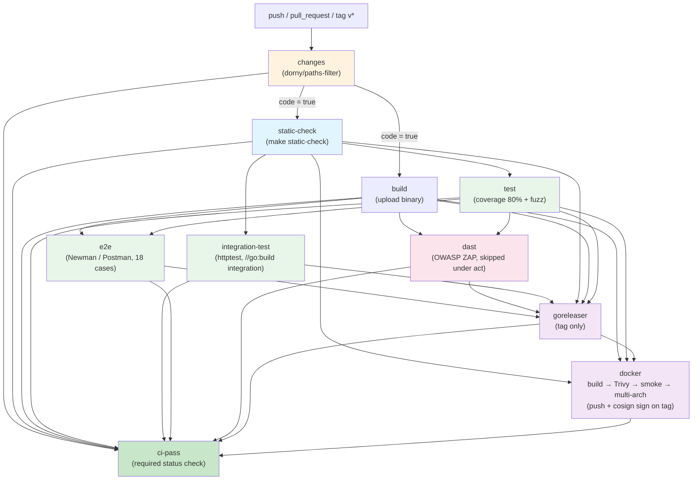

# Architecture

C4 Container, request-flow sequence, and CI/CD pipeline diagrams for the Flight Path API. The System Context diagram lives in the project [README](../README.md#overview).

## C4 Container Diagram

flight-path ships as **one runnable container** — a statically-linked Go binary
that embeds the HTTP server, routing, handlers, the `FindItinerary` algorithm,
and the Swagger UI (via `swaggo/echo-swagger`). It has no datastore, message
broker, cache, or third-party API dependency at runtime — the diagram below
shows the complete runtime topology.

The internal package layout (`internal/{routes,handlers}`, `pkg/api/`) mirrors
the layered-architecture table in the [README Architecture section](../README.md#architecture)
— there is no Component-level surprise that warrants a separate C4 Component
diagram.

## Request Flow — POST /calculate

Sequence diagram showing how a flight path calculation request flows through the system.

## Request Flow — CORS preflight + security headers

Browser-initiated cross-origin requests issue an `OPTIONS` preflight before the
actual `POST`. The CORS middleware answers preflight; the Secure middleware
attaches headers (XCTO, XFO, CSP, HSTS, XSS-Protection, Referrer-Policy) and
Cache-Control / Cross-Origin-Resource-Policy on every response.

## CI/CD Pipeline

The single workflow at [`.github/workflows/ci.yml`](../.github/workflows/ci.yml) runs on every push, pull request, and `v*` tag. A `changes` paths-filter gates every heavy job on whether the push touches code; `ci-pass` is the single required status check for branch protection.

