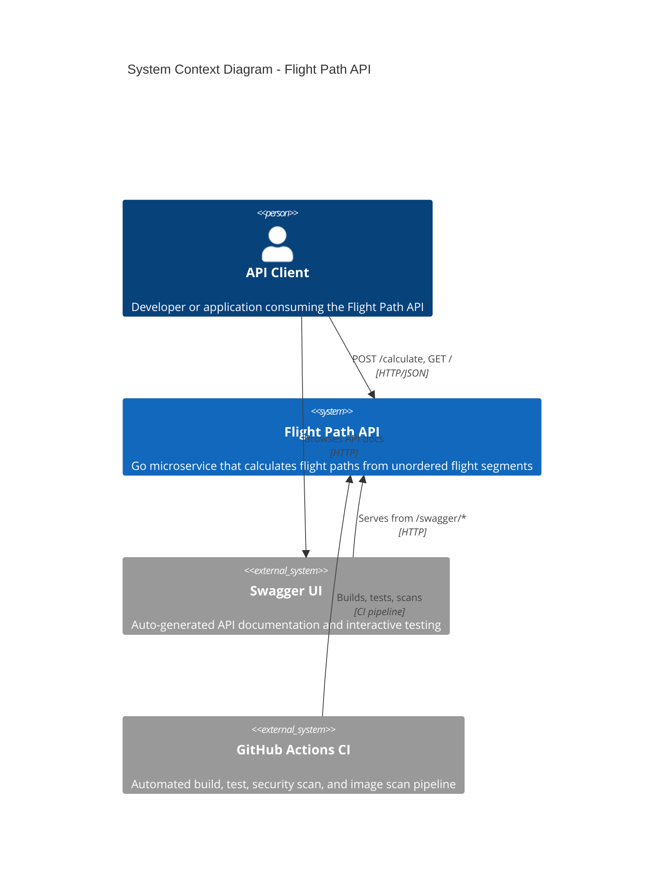
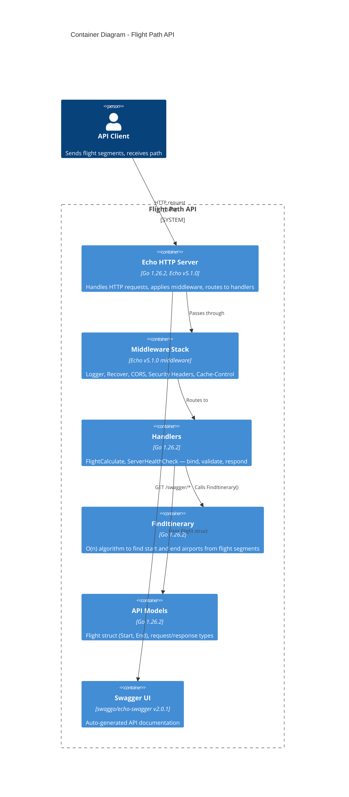
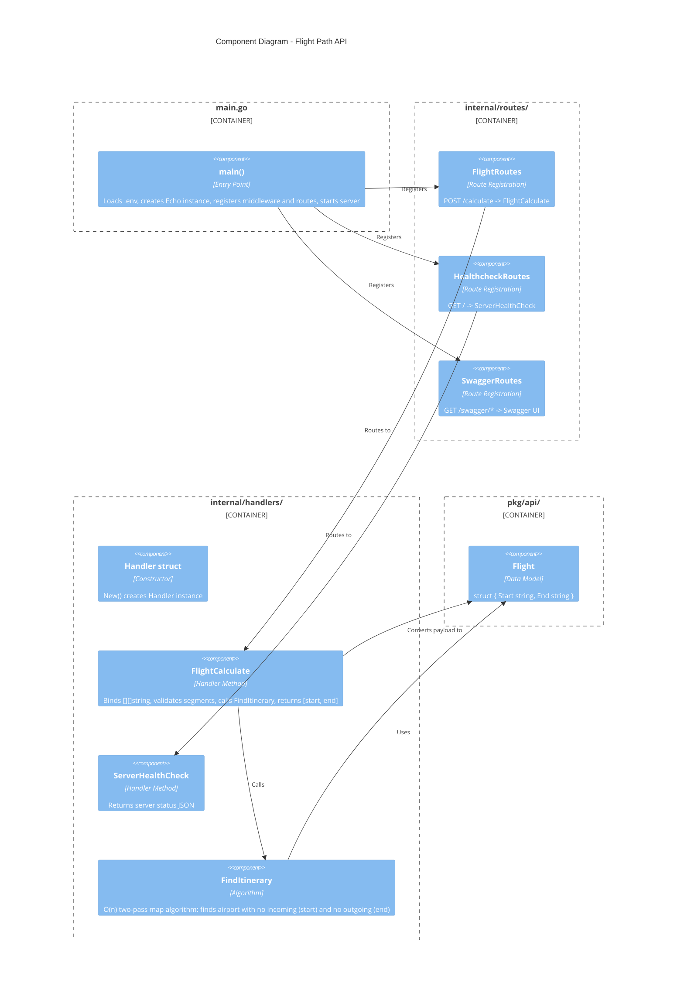
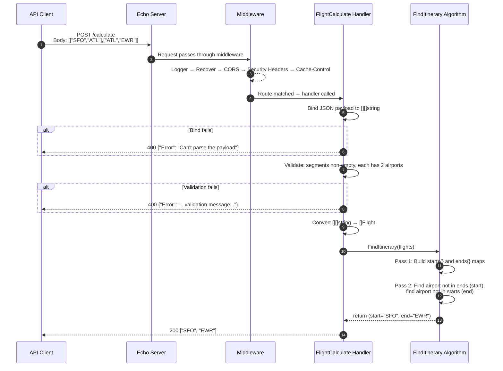
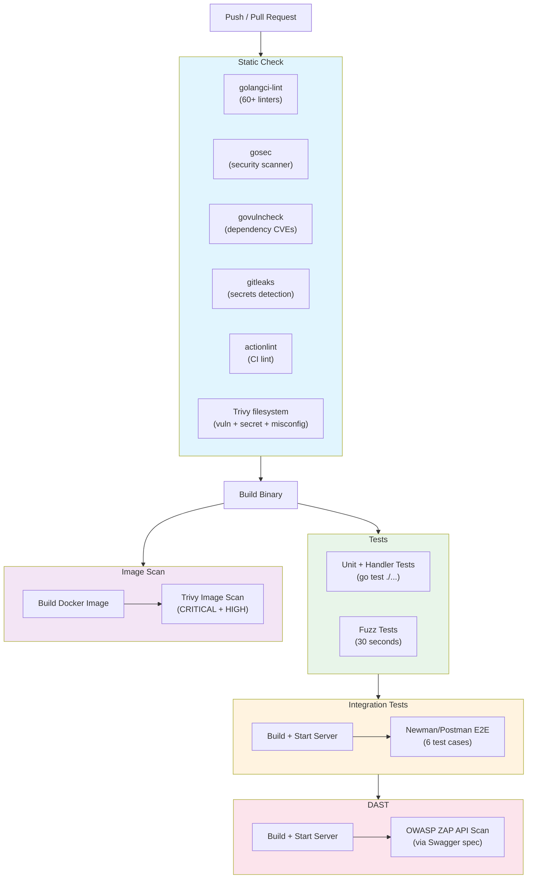

# Architecture

C4 model diagrams and request/CI workflow diagrams for the Flight Path API.

## C4 Context Diagram

Shows the system boundary and external actors interacting with the Flight Path API.

## C4 Container Diagram

Shows the internal containers of the Flight Path API system.

## C4 Component Diagram

Shows the internal components and their relationships.

## Request Flow — POST /calculate

Sequence diagram showing how a flight path calculation request flows through the system.

## CI/CD Pipeline

GitHub Actions workflow showing the build, test, and security scanning pipeline.

